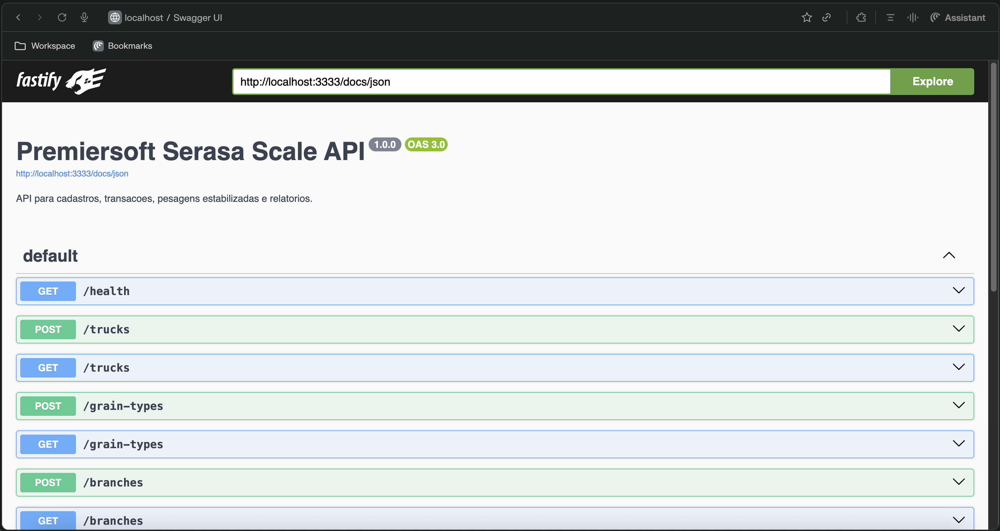
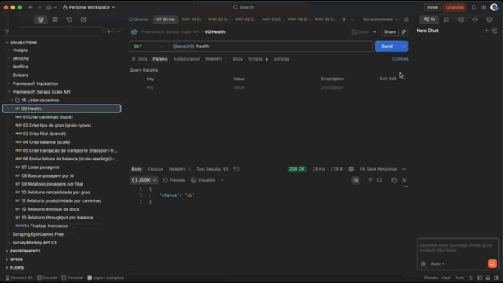

# Premiersoft Serasa Scale API

Backend para receber leituras frequentes de balancas de graos, detectar quando o peso estabilizou e persistir pesagens confiaveis para calculo de carga, custo e relatorios administrativos.

## O que foi entregue

- API HTTP para cadastros de caminhoes, graos, filiais, balancas e transacoes de transporte.
- Endpoint `POST /scale-readings` para receber leituras simuladas de ESP32 a cada 100ms.
- Estabilizacao de peso com janela movel em memoria.
- Persistencia apenas de pesagens estabilizadas.
- Calculo de peso liquido, custo da carga e margem de venda.
- Autenticacao de balancas por token e idempotencia por `Idempotency-Key`.
- Relatorios por filial, grao, caminhao, estoque de doca e throughput por balanca.
- Swagger, OpenAPI, collection Postman, testes automatizados e Docker Compose.

## Stack

- Node.js + TypeScript
- Fastify
- Prisma ORM
- SQLite
- Zod
- Vitest
- Docker Compose

## Como rodar

O caminho recomendado para avaliacao e via Docker:

```bash
docker compose up -d --build
```

A API ficara disponivel em:

- API: `http://localhost:3333`
- Swagger UI: `http://localhost:3333/docs`
- Health check: `http://localhost:3333/health`

Para acompanhar logs:

```bash
docker compose logs -f api
```

Para parar:

```bash
docker compose down
```

Para reiniciar com banco limpo:

```bash
docker compose down -v
docker compose up -d --build
```

## Documentacao da API

- Swagger UI dinamico: `http://localhost:3333/docs`
- Arquivo OpenAPI versionado: [docs/openapi.yaml](/Users/jonathasrochadesouza/Developer/repositories/premiersoft-serasa/docs/openapi.yaml)
- Collection Postman: [docs/postman_collection.json](/Users/jonathasrochadesouza/Developer/repositories/premiersoft-serasa/docs/postman_collection.json)



## Como testar no Postman

1. Importe `docs/postman_collection.json`.
2. Confirme que a variavel `baseUrl` esta como `http://localhost:3333`.
3. Execute em ordem as requests `00` ate `05`.
4. Na request `06 Enviar leitura da balanca`, use o Collection Runner com `31` iteracoes e `100ms` de delay.
5. Depois execute as requests `07` ate `15` para consultar pesagens, relatorios e finalizar a transacao.

A request `06` simula a variacao de peso, envia `Idempotency-Key` e salva o `weighingId` quando a pesagem estabiliza.



## Como validar

Com a API rodando, execute o smoke test automatizado para validar o fluxo HTTP completo:

```bash
pnpm run smoke:api
```

## Testes

Para rodar testes automatizados localmente:

```bash
pnpm install
pnpm run prisma:generate
pnpm test
```

Para validar carga HTTP simulando balancas simultaneas a cada 100ms:

```bash
pnpm run load:100ms:docker
```

## Principais endpoints

- `POST /scale-readings`: recebe leituras da balanca e consolida pesagem quando houver estabilidade.
- `GET /weighings`: lista pesagens estabilizadas.
- `GET /reports/weighings-by-branch`: pesagens por filial.
- `GET /reports/grain-profitability`: rentabilidade por tipo de grao.
- `GET /reports/truck-productivity`: produtividade por caminhao.
- `GET /reports/dock-stock`: estoque de doca.
- `GET /reports/scale-throughput`: throughput por balanca.

O contrato completo esta em [docs/openapi.yaml](/Users/jonathasrochadesouza/Developer/repositories/premiersoft-serasa/docs/openapi.yaml).

## Estabilizacao

As leituras sao agrupadas por `scaleId + plate`. Cada grupo mantem uma janela movel em memoria e gera uma pesagem quando:

- ha leituras suficientes na janela;
- a janela cobre o tempo minimo configurado;
- a variacao entre maior e menor peso fica dentro da tolerancia;
- a presenca do caminhao ainda nao foi processada.

O peso bruto estabilizado e calculado por media aparada. A explicacao completa esta em [docs/stabilization.md](/Users/jonathasrochadesouza/Developer/repositories/premiersoft-serasa/docs/stabilization.md).

## Estrutura

```text
src/
  domain/      regras puras de estabilizacao, precificacao e erros
  services/    casos de uso e persistencia da pesagem consolidada
  http/        rotas, validacao e Swagger
  infra/       cliente Prisma
prisma/        schema e migrations
tests/         testes unitarios e de integracao
docs/          OpenAPI, Postman e estrategia de estabilizacao
```

## Uso de IA

O desafio exige uso de IA na construcao da solucao. O registro esta em [USO_DE_IA.md](/Users/jonathasrochadesouza/Developer/repositories/premiersoft-serasa/USO_DE_IA.md).
